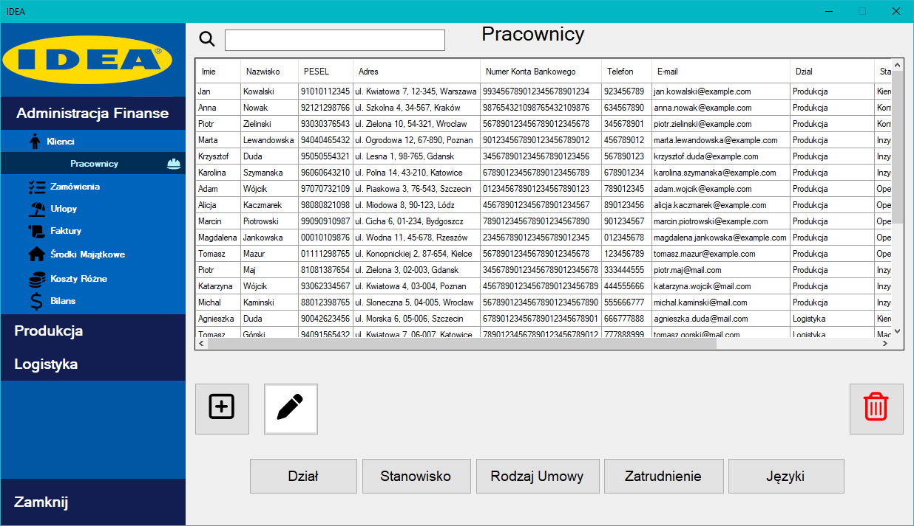

# Business Management Application

## Project Description
This is a **university project** developed as part of a coursework assignment. The application is designed to assist in managing a sample business, handling employees, customers, products, and orders. It was built using **C#**, **Entity Framework**, and **T-SQL**.

## Technologies
- **C# (.NET)**
- **Entity Framework Core**
- **T-SQL (Microsoft SQL Server)**
- **Visual Studio**

## Features
- **Employee Management** – Add, edit, and remove employees.
- **Customer Management** – Register customers and track their order history.
- **Product Management** – Catalog products, their prices, and availability.
- **Order Management** – Create, modify, and track orders.
- **Report Generation** – Generate statistics and business activity reports.

## System Requirements
- Microsoft SQL Server  
- Visual Studio 2022+

